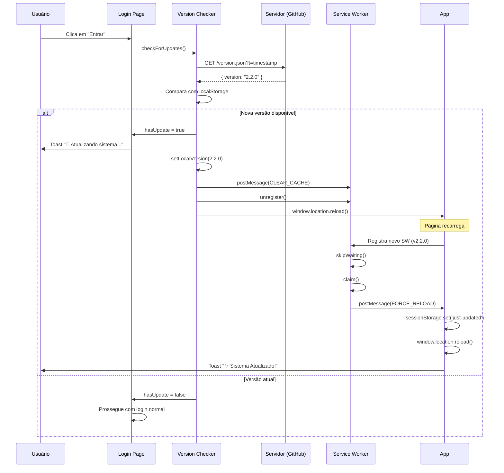

# 🔄 Sistema de Atualização Automática - CarCare v2.2.0

## 📋 Visão Geral

Sistema inteligente que **força atualização automática** quando há mudanças no GitHub, garantindo que todos os usuários sempre vejam a versão mais recente **sem precisar limpar cache manualmente**.

## ✨ Como Funciona

### 1. **Verificação no Login**
Quando o usuário faz login, o sistema:
- ✅ Busca `version.json` do servidor com cache-bust (`?t=timestamp`)
- ✅ Compara com a versão local armazenada
- ✅ Se houver diferença, **força reload completo** antes do login
- ✅ Mostra toast: "🔄 Atualizando sistema... Carregando versão X.X.X"

### 2. **Service Worker Agressivo**
O SW atualizado:
- ✅ **skipWaiting()** imediato na instalação (não espera aprovação)
- ✅ **claim()** de todos os clientes ao ativar
- ✅ Envia mensagem `FORCE_RELOAD` para todos os clientes abertos
- ✅ Limpa automaticamente caches antigos

### 3. **Listener de Mensagens**
O app escuta mensagens do SW:
- ✅ Recebe `FORCE_RELOAD` quando SW é atualizado
- ✅ Salva nova versão no localStorage
- ✅ Marca flag `carcare-just-updated` no sessionStorage
- ✅ Faz `window.location.reload()` imediato

### 4. **Notificação Pós-Atualização**
After reload:
- ✅ Root layout detecta flag `carcare-just-updated`
- ✅ Mostra toast: "✨ Sistema Atualizado! Você está usando a versão X.X.X"
- ✅ Remove flag para não mostrar novamente

## 🚀 Fluxo Completo



## 📝 Como Fazer Deploy Atualizado

### Passo 1: Atualizar Versão
```json
// public/version.json
{
  "version": "2.3.0",  // ⬅️ INCREMENTAR AQUI
  "buildDate": "2026-02-10T12:00:00.000Z",
  "description": "Nova funcionalidade X"
}
```

### Passo 2: Atualizar Service Worker
```javascript
// public/service-worker.js
const CACHE_VERSION = 'v2.3.0'; // ⬅️ INCREMENTAR AQUI TAMBÉM
```

### Passo 3: Fazer Deploy
```bash
git add -A
git commit -m "feat: nova funcionalidade X (v2.3.0)"
git push
```

### Passo 4: Aguardar GitHub Pages Build
- ⏱️ Aguarde 1-2 minutos para o GitHub Pages processar
- ✅ Verifique se o site está atualizado: https://seusite.github.io/carcare/version.json

## 🎯 Comportamento Esperado

### Para Usuários em Navegador Normal
1. Faz logout do sistema
2. Faz login novamente
3. **Sistema detecta nova versão automaticamente**
4. Mostra "🔄 Atualizando sistema..."
5. Recarrega página automaticamente
6. Mostra "✨ Sistema Atualizado! Versão 2.3.0"
7. **Tudo pronto, sem limpar cache!**

### Para Usuários com PWA Instalado
1. Abre o PWA
2. **SW detecta nova versão automaticamente**
3. Força reload imediato via postMessage
4. Mostra "✨ Sistema Atualizado! Versão 2.3.0"
5. **Tudo pronto, sem reinstalar PWA!**

## 🔧 Características Técnicas

### Cache Busting
```typescript
// version-checker.ts
const timestamp = new Date().getTime()
fetch(`/carcare/version.json?t=${timestamp}`, {
  cache: 'no-cache',
  headers: {
    'Cache-Control': 'no-cache, no-store, must-revalidate',
    Pragma: 'no-cache',
  },
})
```

### Estratégia de Cache do SW
- **HTML/JS/JSON**: Sempre busca do servidor primeiro (Network First)
- **Imagens**: Cache First para performance
- **Limpeza**: Remove automaticamente caches antigos

### Armazenamento
- `localStorage.carcare-app-version`: Versão atual do app
- `localStorage.carcare-last-version-check`: Timestamp da última verificação
- `sessionStorage.carcare-just-updated`: Flag temporária de atualização

## 🐛 Troubleshooting

### "Não está aparecendo a nova versão"

**Verifique:**
1. ✅ Incrementou `version.json`?
2. ✅ Incrementou `CACHE_VERSION` no service-worker.js?
3. ✅ Fez push para o GitHub?
4. ✅ Aguardou GitHub Pages build (1-2 min)?
5. ✅ Testou com **logout → login**?

**Teste no console:**
```javascript
// Verificar versão local
localStorage.getItem('carcare-app-version')

// Verificar versão do servidor
fetch('/carcare/version.json?t=' + Date.now())
  .then(r => r.json())
  .then(console.log)

// Forçar atualização manual
localStorage.removeItem('carcare-app-version')
location.reload()
```

### "Ainda vejo cache antigo"

**Solução 1: Desregistrar SW manualmente**
```javascript
// No console do navegador
navigator.serviceWorker.getRegistrations()
  .then(regs => regs.forEach(reg => reg.unregister()))
  .then(() => location.reload())
```

**Solução 2: Hard Refresh**
- Windows/Linux: `Ctrl + Shift + R`
- Mac: `Cmd + Shift + R`

**Solução 3: DevTools**
1. F12 → Application → Service Workers
2. Clique em "Unregister"
3. Application → Storage → Clear site data
4. Recarregue a página

## 📊 Logs para Debug

### Service Worker
```javascript
// No console, veja logs do SW:
[ServiceWorker] Installing version: v2.2.0
[ServiceWorker] Skip waiting - force activation
[ServiceWorker] Activating version: v2.2.0
[ServiceWorker] Deleting old cache: carcare-static-v2.1.0
[ServiceWorker] Claiming clients immediately
[ServiceWorker] Forcing reload on all clients
[ServiceWorker] Sending FORCE_RELOAD to client
```

### Version Checker
```javascript
[VersionChecker] Checking for updates...
[VersionChecker] Server version: 2.2.0
[VersionChecker] Comparing versions: { local: '2.1.0', server: '2.2.0' }
[VersionChecker] Update detected! { from: '2.1.0', to: '2.2.0' }
[VersionChecker] Forcing application update...
[VersionChecker] Received FORCE_RELOAD from SW
```

### Login
```javascript
[Login] Nova versão detectada, forçando atualização...
```

## 🎨 Mensagens ao Usuário

### Durante Atualização
```
🔄 Atualizando sistema...
Carregando versão 2.2.0
```

### Após Atualização
```
✨ Sistema Atualizado!
Você está usando a versão 2.2.0
```

## 🔐 Segurança

- ✅ **Sem dados perdidos**: Zustand persiste tudo no localStorage
- ✅ **Session preservada**: Login é mantido após reload
- ✅ **Rollback automático**: Se houver erro, cache antigo é usado
- ✅ **Verificação de integridade**: Compara versões antes de aplicar

## 📈 Versionamento Semântico

Use **Semantic Versioning**:
- **Major (X.0.0)**: Mudanças incompatíveis (breaking changes)
- **Minor (0.X.0)**: Novas funcionalidades (backward compatible)
- **Patch (0.0.X)**: Correções de bugs

Exemplo:
- `2.0.0` → Reescrita completa do sistema
- `2.1.0` → Adicionou relatórios
- `2.1.1` → Corrigiu bug nos relatórios

## ✅ Checklist de Deploy

- [ ] Atualizar `version` em `public/version.json`
- [ ] Atualizar `CACHE_VERSION` em `public/service-worker.js`
- [ ] Atualizar `buildDate` em `version.json`
- [ ] Adicionar `description` da mudança em `version.json`
- [ ] Commit com mensagem descritiva
- [ ] Push para GitHub
- [ ] Aguardar build (1-2 min)
- [ ] Testar: logout → login → ver toast de atualização

## 🎉 Benefícios

1. ✅ **Zero configuração para usuários**: Atualização automática
2. ✅ **Sempre a versão mais recente**: Sem cache preso
3. ✅ **Funciona em todos os dispositivos**: PC, celular, tablet
4. ✅ **PWA e navegador**: Funciona em ambos
5. ✅ **Feedback visual**: Toast mostrando que atualizou
6. ✅ **Sem perda de dados**: Session e localStorage preservados
7. ✅ **Deploy simples**: Apenas incrementar versão e fazer push

---

**Versão do Guia**: 2.2.0  
**Última Atualização**: 10/02/2026  
**Desenvolvedor**: Leandro Yata
